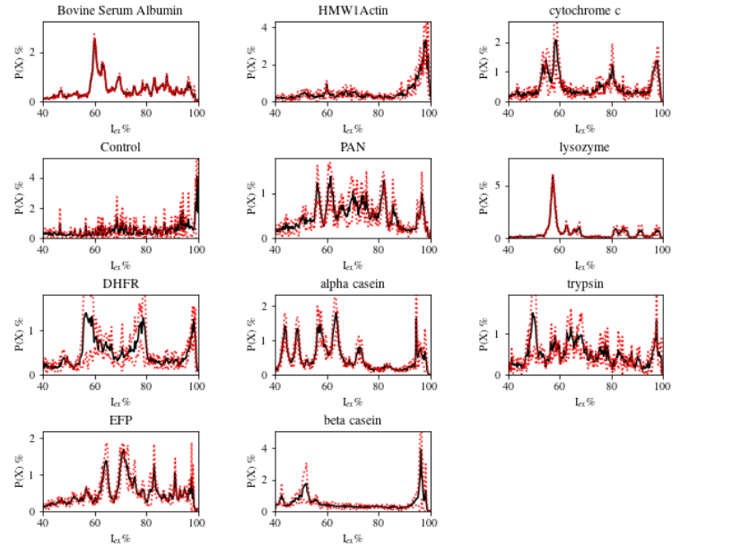
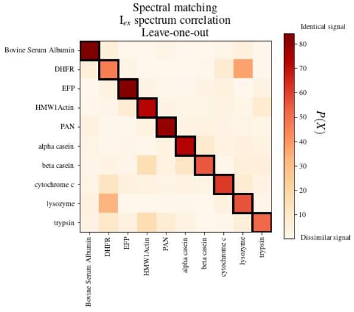

# README: Nanopore protein sequencing signal analysis process

## Background

The nanopore detection system uses nanometer-sized holes embedded in an insulating film as its core, and the insulating film is flanked by two chambers filled with electrolyte. At the same time, a fixed voltage is applied to both ends of the chamber, which causes ions to continuously pass through the nanopores, leading to the formation of current. Under the action of this current, biomolecules can be driven by it and pass through the nanopores. When biomolecules pass through the nanopore, the passage of ions will be hindered, resulting in a change in the magnitude of the current in the pore. When the size, mass, and charge of the molecules passing through the nanopore change, it will also cause different current changes. This is the data obtained and analyzed by the nanopore experiment: the electrical signal that changes with time.

This is a scientific research project I conducted in the second semester of my sophomore year at Shanghai Jiao Tong University. In the project, our main work was to build a python pipeline for analyzing nanopore protein sequencing signals. Finally, the program can read the signal file (from mass spectrometry or nanopore), and then perform initial signal processing, drawing, fitting, etc.

The main experimental files are in: `experiment.ipynb` (project requirements, code comments are mainly in English), and some auxiliary calculation codes are in the `python_scripts` folder. Some of the main output results are also shown in the picture（Drawn by python codes，demonstrated in the `experiment.iptnb` file）.  

The first picture shows one important step in our pre-processing. In this step, we aim to fit Electric Intensity versus proteins' Molecular Weight. This helps us to understand and infer the basic principles of nanopore signals.

The following picture is an important intermediate output of the analysis process built by the project, which shows the nanopore electrical signal data intensity and probability distribution corresponding to various proteins.

 
This picture is the output of an important verification link of the project. It shows the similarity between the protein nanopore electrical signal data and mass spectrometry data, verifying the accuracy of our process: 

In addition, in the `Overview.docx` file, I wrote an overview article on nanopore signal identification. It mainly discusses the principles, development, and application status of nanopore protein recognition. (Written in Chinese)
